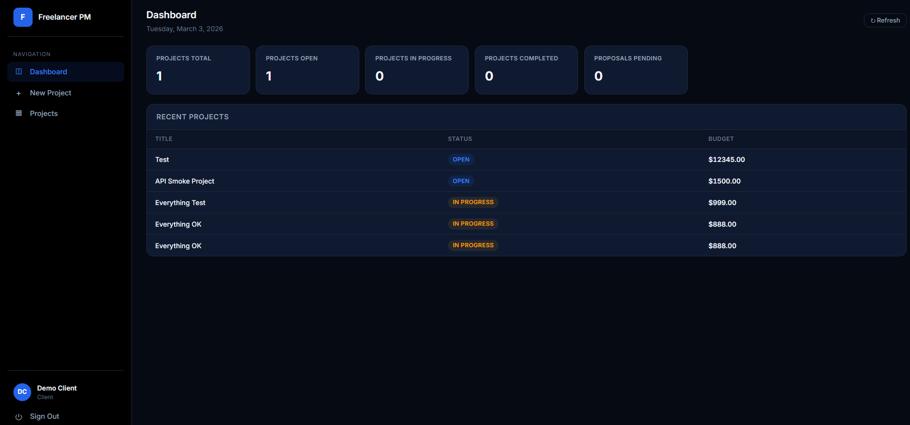
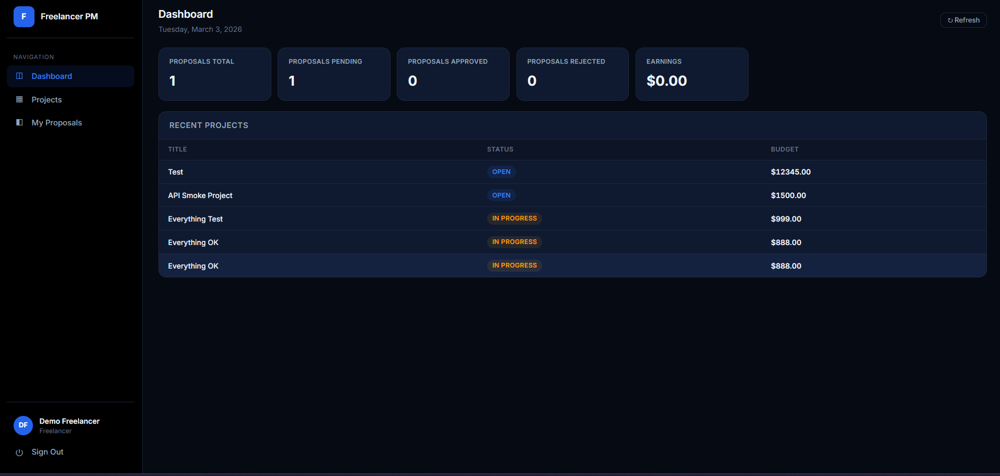
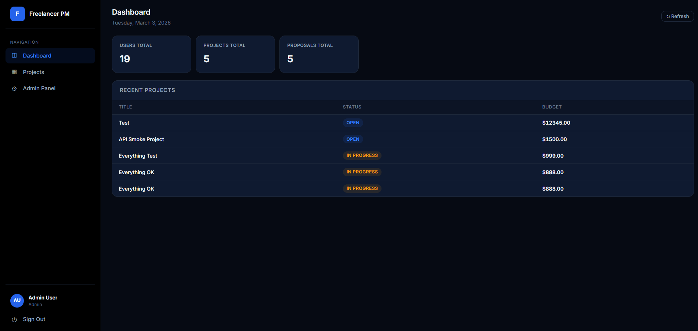

# Freelancer Project & Client Management System

Full-stack project management platform built with **React + FastAPI**.  
Role-based dashboards for clients, freelancers, and admins — production-ready with Docker.

---

## Screenshots

### Client Dashboard


### Freelancer Dashboard


### Admin Panel


---

## Stack

| Layer     | Technology                           |
|-----------|--------------------------------------|
| Frontend  | React 18 + Vite 7                    |
| Backend   | FastAPI + SQLAlchemy + JWT           |
| Database  | PostgreSQL (SQLite fallback for dev) |
| Deploy    | Docker Compose / Nginx / Gunicorn    |

## Features

- **JWT Authentication** — register, login, token-protected endpoints
- **Role-Based Access Control** — `admin`, `client`, `freelancer`
- **Projects** — create, list, update status, budget tracking
- **Proposals** — freelancers bid on projects, clients approve/reject
- **Tasks** — per-project task board with assignee & completion
- **Dashboard** — role-specific metrics (earnings, counts, stats)
- **Admin Panel** — user management (list, suspend, activate, delete)
- **Responsive UI** — dark-themed dashboard, mobile-friendly
- **Database Seeding** — demo accounts created on first run
- **Docker Production Stack** — one-command deployment

---

## Quick Start

### Prerequisites
- Python 3.11+
- Node.js 20+

### One-Click (Windows)

Double-click **`start.bat`** — it installs everything, seeds the database, and opens the app.

### Manual Setup

**Backend:**
```powershell
cd backend
python -m venv .venv
.\.venv\Scripts\Activate.ps1
pip install -r requirements.txt
python -m app.seed
uvicorn app.main:app --reload
```

**Frontend:**
```powershell
cd frontend
npm install
npm run dev
```

| Service      | URL                          |
|--------------|------------------------------|
| Frontend     | http://localhost:5180        |
| Backend API  | http://127.0.0.1:8000       |
| Swagger Docs | http://127.0.0.1:8000/docs  |

### Demo Accounts (seeded automatically)

| Email                 | Password       | Role       |
|-----------------------|----------------|------------|
| admin@demo.com        | admin123       | admin      |
| client@demo.com       | client123      | client     |
| freelancer@demo.com   | freelancer123  | freelancer |

---

## Docker Deployment

```bash
docker compose up --build -d
```

Runs **PostgreSQL 16** + **FastAPI/Gunicorn** (port 8000) + **React/Nginx** (port 80).

```bash
docker compose down -v   # tear down
```

---

## Environment Variables

Create a `.env` file in the project root (not committed to git):

```env
SECRET_KEY=your-secret-key
ALGORITHM=HS256
ACCESS_TOKEN_EXPIRE_MINUTES=60
DATABASE_URL=sqlite:///./freelancer_pm.db
VITE_API_URL=http://127.0.0.1:8000
```

See `.env.example` for the template. Docker Compose sets `DATABASE_URL` automatically.

---

## Project Structure

```
├── start.bat                    # One-click launcher
├── stop.bat                     # Kill running servers
├── docker-compose.yml           # Production orchestration
├── .env.example                 # Environment template
├── img/                         # Screenshots
│
├── backend/
│   ├── Dockerfile
│   ├── requirements.txt
│   └── app/
│       ├── main.py              # FastAPI app + CORS + routers
│       ├── models.py            # User, Project, Proposal, Task
│       ├── schemas.py           # Pydantic request/response schemas
│       ├── db.py                # Engine + session factory
│       ├── deps.py              # JWT decode + RBAC dependencies
│       ├── seed.py              # Demo account seeder
│       ├── core/
│       │   ├── config.py        # Settings (pydantic-settings)
│       │   └── security.py      # Password hashing + JWT
│       └── routers/
│           ├── auth.py          # /auth
│           ├── projects.py      # /projects
│           ├── dashboard.py     # /dashboard
│           └── admin.py         # /admin
│
└── frontend/
    ├── Dockerfile
    ├── nginx.conf
    ├── package.json
    ├── vite.config.js
    ├── index.html
    └── src/
        ├── main.jsx
        ├── App.jsx
        └── styles/
            └── theme.css
```

## API Reference

### Auth
| Method | Endpoint         | Description       | Access  |
|--------|------------------|-------------------|---------|
| POST   | `/auth/register` | Create account    | Public  |
| POST   | `/auth/login`    | Get JWT token     | Public  |
| GET    | `/auth/me`       | Current user info | Bearer  |

### Projects
| Method | Endpoint                          | Description            | Role              |
|--------|-----------------------------------|------------------------|-------------------|
| POST   | `/projects`                       | Create project         | client            |
| GET    | `/projects`                       | List all               | authenticated     |
| GET    | `/projects/my-client`             | My projects            | client            |
| PATCH  | `/projects/{id}/status`           | Update status          | client (owner)    |
| POST   | `/projects/{id}/proposals`        | Submit proposal        | freelancer        |
| GET    | `/projects/my-proposals`          | My proposals           | freelancer        |
| GET    | `/projects/{id}/proposals`        | Project proposals      | client/admin      |
| PATCH  | `/projects/proposals/{id}/status` | Approve/reject         | client (owner)    |
| POST   | `/projects/{id}/tasks`            | Create task            | client (owner)    |
| GET    | `/projects/{id}/tasks`            | List tasks             | client/freelancer |
| PATCH  | `/projects/tasks/{id}`            | Update task            | client/freelancer |

### Dashboard
| Method | Endpoint             | Description        | Access |
|--------|----------------------|--------------------|--------|
| GET    | `/dashboard/summary` | Role-based metrics | Bearer |

### Admin
| Method | Endpoint                     | Description    | Role  |
|--------|------------------------------|----------------|-------|
| GET    | `/admin/users`               | List users     | admin |
| PATCH  | `/admin/users/{id}/suspend`  | Suspend user   | admin |
| PATCH  | `/admin/users/{id}/activate` | Activate user  | admin |
| DELETE | `/admin/users/{id}`          | Delete user    | admin |
| GET    | `/admin/stats`               | Platform stats | admin |

---

## Troubleshooting

| Issue | Fix |
|-------|-----|
| `npm`/`node` not found | Install Node.js, restart terminal |
| `uvicorn` not found | Activate venv first |
| PowerShell blocked | `Set-ExecutionPolicy RemoteSigned -Scope CurrentUser` |
| Port in use | `netstat -ano \| findstr :8000` → `taskkill /PID <pid> /F` |
| CORS errors | Verify `VITE_API_URL` matches backend address |

---

## License

MIT
