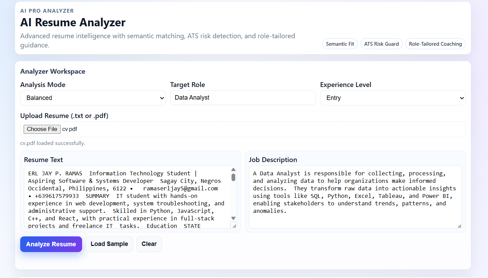
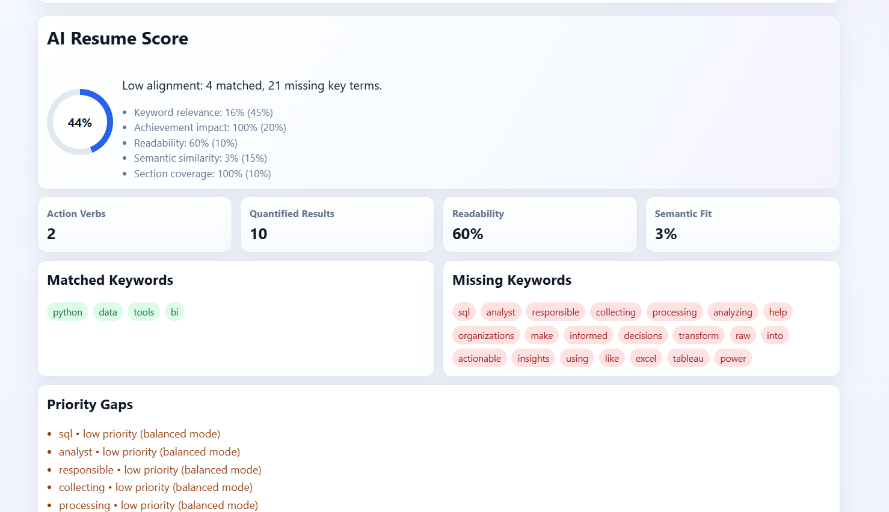
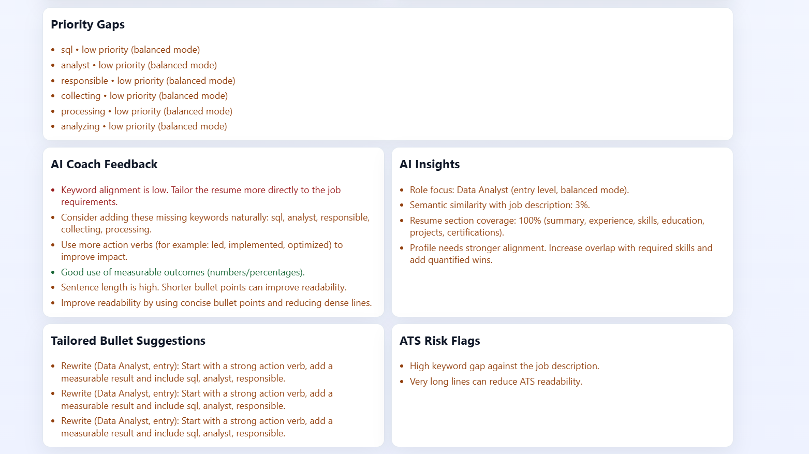

# AI Resume Analyzer

> A lightweight, client-side resume analysis tool with NLP-powered feedback, ATS scoring, and role-tailored coaching — no server required.

---

## Features

- **NLP-Based Writing Feedback** — Action verbs, quantified results, and readability analysis
- **Keyword Matching** — Compare your resume against any job description
- **3 Analysis Modes** — Balanced, Strict ATS, and Creative Coach
- **Weighted ATS Score Breakdown** — With semantic fit scoring
- **Priority Gap Detection** — Severity-labeled suggestions for missing skills
- **Resume Upload** — Supports `.txt` and `.pdf` files
- **AI Insights** — Semantic similarity analysis and section coverage checks
- **ATS Risk Flags** — Identifies formatting and content issues that trip up applicant tracking systems
- **Bullet Rewrite Suggestions** — Tailored rewrites to strengthen weak resume lines

---

## Screenshots

| Score Breakdown | Detailed Analysis |
|:---:|:---:|
|  |  |

---

## Tech Stack

| Layer | Technology |
|-------|------------|
| Frontend | HTML, CSS, JavaScript |
| Logic | Client-side NLP heuristics |
| File Parsing | Browser-based `.txt` / `.pdf` reader |

> No backend, no dependencies, no API keys — just open and use.

---

## Getting Started

1. Clone or download this repo.
2. Open `index.html` in any modern browser.
3. That's it — no install or build step needed.

---

## How It Works

1. **Upload** your resume (`.txt` / `.pdf`) or paste the text directly.
2. **Paste** the target job description.
3. *(Optional)* Choose an analysis mode, target role, and experience level.
4. Click **Analyze Resume**.
5. Review your results:
   - AI resume score with mode-based weighted breakdown
   - Action verbs, quantified results, readability, and semantic fit
   - Matched vs. missing keywords
   - Priority gaps with severity labels
   - AI coach feedback and insights
   - Tailored bullet rewrite suggestions
   - ATS risk flags

---

## Quick Actions

| Button | What It Does |
|--------|-------------|
| **Load Sample** | Fills in sample resume + job description for a quick test |
| **Clear** | Resets all inputs and results |
| **Upload Resume** | Opens a file picker for `.txt` or `.pdf` |

---

## Notes

- Fully client-side — your resume data never leaves your browser.
- Results are heuristic-based and intended as guidance, not a guarantee.
