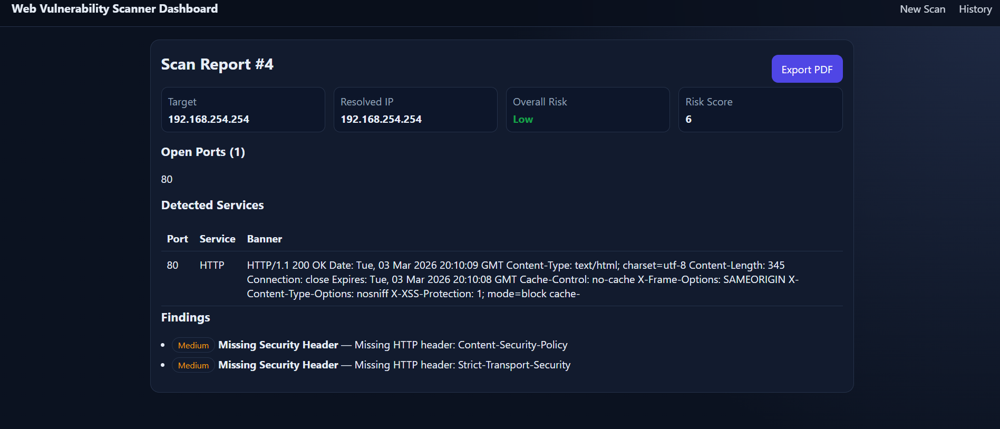

# Web Vulnerability Scanner Dashboard

> A Flask-based web dashboard for scanning authorized targets in local/controlled environments — featuring port scanning, service detection, security header checks, risk scoring, and exportable reports.

.png)

---

## Features

- **Target Validation** — Accepts IPs and domains with built-in format checks
- **Multi-Threaded Port Scanning** — Fast TCP port scanning across custom port ranges
- **Service Detection & Banner Grabbing** — Identifies running services on open ports
- **HTTP Security Header Checks** — Flags missing or misconfigured headers
- **TLS Checks** — Basic certificate and protocol validation
- **Risk Scoring** — Classifies findings as Low / Medium / High severity
- **HTML & PDF Report Export** — Download scan results as a formatted PDF
- **Scan History** — All past scans stored in a local SQLite database

---

## Screenshot

| Report View |
|:---:|
|  |

---

## Tech Stack

| Layer | Technology |
|-------|------------|
| Backend | Python, Flask |
| Scanner | Multi-threaded TCP engine, banner grabbing, HTTP/TLS checks |
| Reports | ReportLab (PDF generation) |
| Database | SQLite |
| Frontend | Jinja2 templates, CSS |

---

## Getting Started

### Prerequisites
- Python 3.8+

### Setup

```bash
# 1. Clone the repo and navigate into it
cd Web-Based Vulnerability Scanner

# 2. Create and activate a virtual environment
python -m venv .venv
# Windows
.venv\Scripts\activate
# macOS/Linux
source .venv/bin/activate

# 3. Install dependencies
pip install -r requirements.txt

# 4. Start the app
python app.py
```

Then open **http://127.0.0.1:5000** in your browser.

---

## Project Structure

```
Web-Based Vulnerability Scanner/
├── app.py              # Flask app & routes
├── reporting.py        # PDF report generation
├── storage.py          # SQLite scan history
├── requirements.txt
├── scanner/
│   ├── engine.py           # Scan orchestration
│   ├── port_scanner.py     # TCP port scanning
│   ├── service_detection.py# Banner grabbing & service ID
│   ├── vuln_checks.py      # HTTP header & TLS checks
│   ├── risk.py             # Risk scoring logic
│   └── validators.py       # Target validation & resolution
├── templates/
│   ├── index.html      # Dashboard / scan form
│   ├── report.html     # Scan report view
│   └── history.html    # Scan history list
└── static/
    └── styles.css
```

---

## Scope Guard

By default, scanning is restricted to **private/loopback IP** targets to prevent misuse. To disable this restriction in a controlled lab environment, set:

```python
STRICT_SCOPE = False
```

inside `app.py`.

---

## Ethical Use

> **This tool is for authorized testing only.**
> Only scan systems you own or have explicit written permission to test. Unauthorized scanning may violate laws and regulations.
