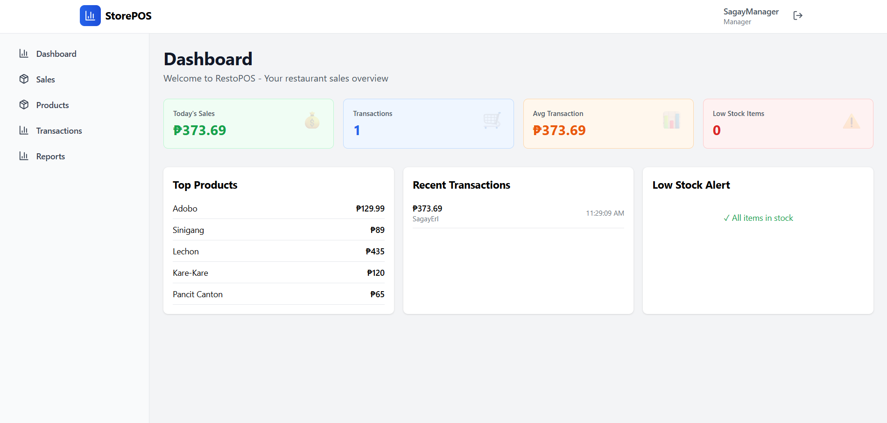
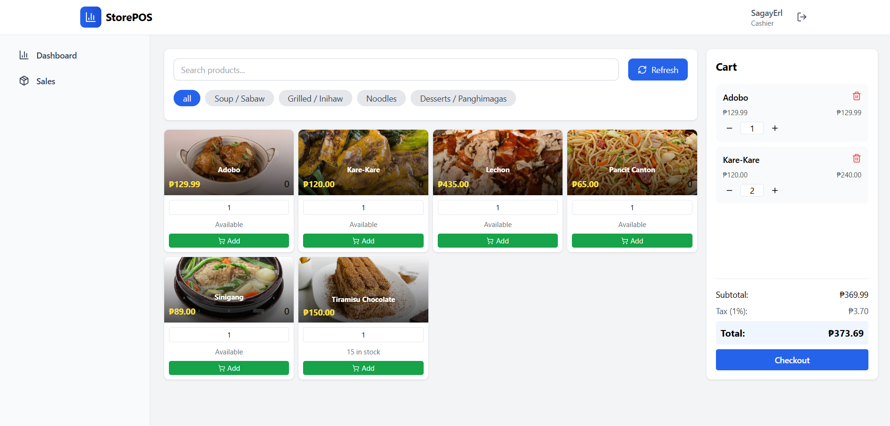
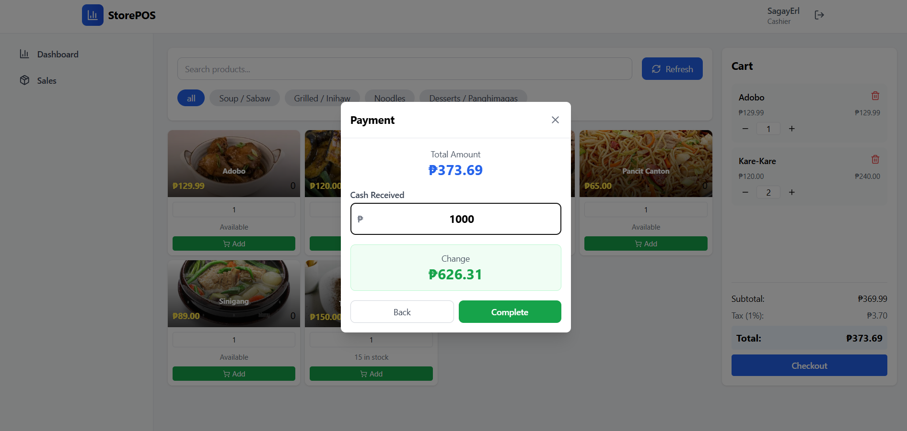
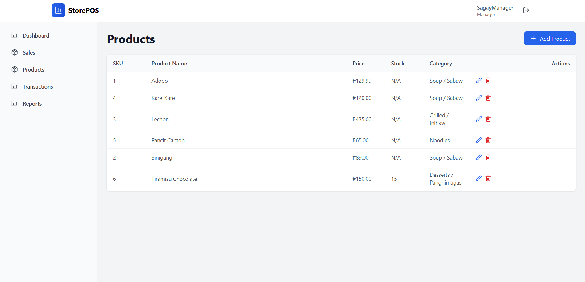
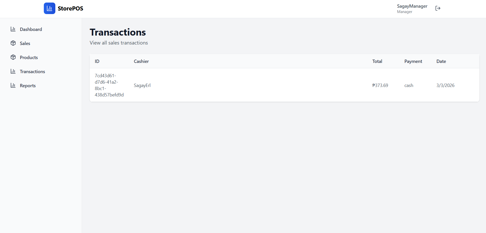
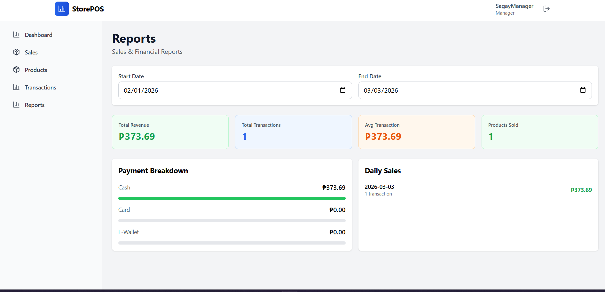

# 🏪 StorePOS

### A Modern Point of Sale System

**A fast, intuitive, and offline-capable POS system designed for small to medium businesses.**

[Features](#-features) · [Screenshots](#-screenshots) · [Tech Stack](#-tech-stack) · [Getting Started](#-getting-started) · [API Reference](#-api-reference)

---

## 📸 Screenshots

### Dashboard
> Real-time sales overview with key business metrics and analytics at a glance.

---

### Sales Terminal
> Streamlined checkout with product grid, cart management, and instant payment processing.

---

### Checkout
> Quick and easy checkout flow supporting cash, card, and e-wallet payments.

---

### Products Management
> Full inventory control — add, edit, categorize, and track stock levels.

---

### Transactions
> Complete transaction history with search, filtering, and detailed views.

---

### Reports & Analytics
> Actionable insights: sales summaries, top products, profit tracking, and more.

---

## ✨ Features

<table>
<tr>
<td width="50%">

### 🛒 Sales & Checkout
- Click-and-go checkout flow
- Multiple payment methods (cash, card, e-wallet)
- Real-time cart management
- Complete transaction history

</td>
<td width="50%">

### 📦 Inventory Management
- Product CRUD with categories
- Real-time stock updates
- Low-stock alerts
- Organized product grid

</td>
</tr>
<tr>
<td width="50%">

### 📊 Reports & Analytics
- Daily / weekly / monthly sales summaries
- Best-selling products tracking
- Profit margin monitoring
- Payment method breakdown

</td>
<td width="50%">

### 👥 User & Role Management
- **Admin** — Full system access
- **Manager** — Inventory & reports
- **Cashier** — Sales processing only
- Secure JWT authentication

</td>
</tr>
<tr>
<td colspan="2" align="center">

### 🔌 Offline-First Architecture
Works without internet · Auto-syncs when reconnected · SQLite local storage ensures zero data loss

</td>
</tr>
</table>

---

## 🛠 Tech Stack

<table>
<tr>
<th align="center">Frontend</th>
<th align="center">Backend</th>
<th align="center">DevOps</th>
</tr>
<tr>
<td>

- **React 18** — UI Framework
- **TypeScript** — Type Safety
- **Vite** — Build Tool
- **Tailwind CSS** — Styling
- **Zustand** — State Management
- **React Router** — Routing

</td>
<td>

- **Node.js + Express** — API Server
- **SQLite 3** — Database
- **JWT** — Authentication
- **bcryptjs** — Password Hashing

</td>
<td>

- **Concurrently** — Dev Scripts
- **ESLint** — Code Quality
- **Git** — Version Control

</td>
</tr>
</table>
